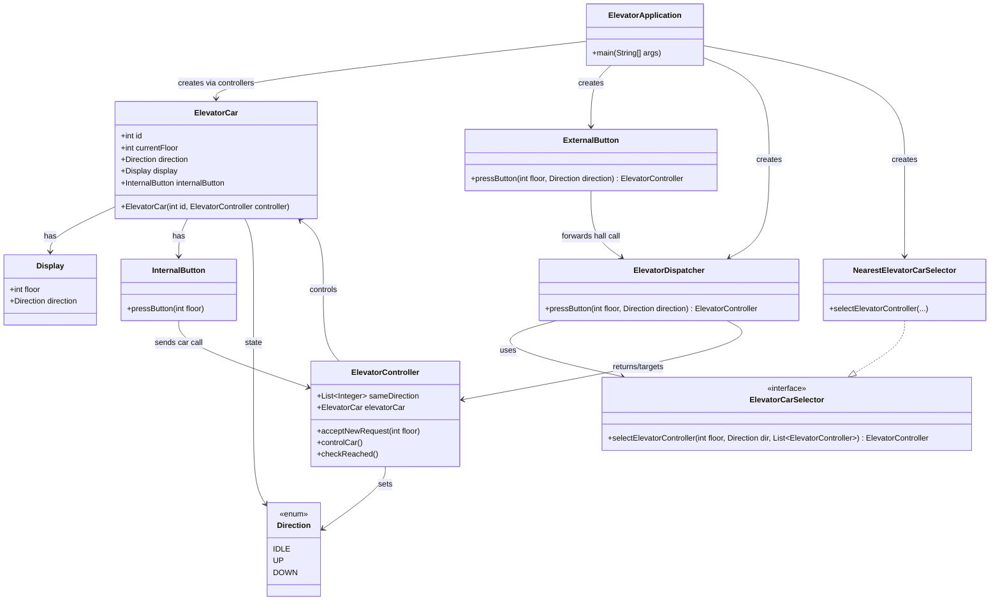

# Elevator System — org.example.elevator.system

This module contains a minimal, testable model of a multi-elevator (multi-car) system. It demonstrates:
- How hall calls (external button presses) are dispatched to elevator cars.
- How car calls (internal button presses) are queued and served in-order with direction awareness.
- How a selection strategy (NearestElevatorCarSelector) chooses the best elevator for a hall call.

The focus is on separation of concerns: models for devices (cars, buttons, displays), controllers for behavior, and strategy interfaces for selection.

## 1) Overview
- Entry point: ElevatorApplication wires two elevator cars and simulates a sequence of external and internal button presses.
- ExternalButton represents hall panels on floors; it forwards calls to an ElevatorDispatcher.
- ElevatorDispatcher chooses an ElevatorController using ElevatorCarSelector (strategy), then seeds the request to that controller.
- ElevatorController maintains the car’s pending stops and moves the car one floor per controlCar() tick.
- InternalButton represents cabin panels; pressing it adds a destination (car call) to the car’s controller.

## 2) Package Structure
- model
  - Direction: enum { IDLE, UP, DOWN }
  - Display: DTO for current floor and direction (simplified; not actively pushed in the demo).
  - ElevatorCar: car state (id, currentFloor, direction, display, internal button).
  - ExternalButton: floor hall button calling into dispatcher.
  - InternalButton: cabin button that sends a request to its ElevatorController.
- service
  - ElevatorController: holds the request queue (sameDirection) and drives the car state step by step.
  - ElevatorDispatcher: entry for hall calls; uses a strategy to select a controller, then enqueues the floor.
  - ElevatorCarSelector: strategy interface for selecting an elevator controller for a hall call.
  - NearestElevatorCarSelector: implementation that chooses by effective distance considering direction and remaining path.
- ElevatorApplication: demo main(), creates two cars and runs a simulated scenario.

## 3) Execution — How to Run
Option A: From an IDE
- Run: org.example.elevator.system.ElevatorApplication

Option B: From command line (Maven)
- Build: mvn -q -DskipTests package
- Run:  java -cp target/classes org.example.elevator.system.ElevatorApplication

The program prints the current floor and direction for each car at each tick, and advances cars by one floor per tick.

## 4) Core Flow
1. Hall Call (External)
   - A user presses ExternalButton.pressButton(floor, direction).
   - ElevatorDispatcher selects the best ElevatorController via ElevatorCarSelector.
   - The chosen controller receives acceptNewRequest(floor) to enqueue the stop.

2. Car Call (Internal)
   - Once inside a car, a user presses InternalButton.pressButton(floor).
   - It simply calls elevatorController.acceptNewRequest(floor) for its own car.

3. Movement
   - On each system tick (in the demo, printElevator calls controlCar() for each controller),
     ElevatorController decides direction and moves the car by one floor.
   - When reaching the head of the queue, that stop is removed; direction is updated or set to IDLE when no more requests remain.

## 5) Dispatch Strategy: NearestElevatorCarSelector
- For an IDLE car: cost = distance to requested floor.
- For a car moving in the same direction and the request is ahead of it: cost = distance if ahead; otherwise not preferred.
- For opposite direction: cost = distance to finish current route (to the last queued stop) plus distance from there to the requested floor.
- The controller with the minimal cost is chosen.

Note: The selector inspects current car state and the controller’s sameDirection list to approximate real-world behavior while keeping the implementation compact.

## 6) Request Queueing in ElevatorController
- sameDirection: List<Integer> representing upcoming stops. Insertion preserves a roughly monotonic path according to current direction.
- acceptNewRequest(floor):
  - Rejects duplicates.
  - If queue empty: sets direction toward the requested floor and enqueues it.
  - If queue not empty: performs direction-aware ordered insertion so the car continues in its current direction when possible.
- controlCar():
  - If no requests: set direction to IDLE.
  - Else: compute direction to the next stop, move one floor toward it, and call checkReached().
- checkReached():
  - If currentFloor equals the head stop, pop it; update direction to next target or IDLE.

Assumptions and Simplifications:
- Floors are integer-indexed; ElevatorApplication initializes cars at floor 1.
- Doors, load, dwell times, and safety systems are not modeled.
- No separate queues for up/down hall calls. A single list represents the current route.

## 7) Sample Scenario (from ElevatorApplication)
- Two elevators are created (both start at floor 1, IDLE).
- External UP call at floor 3 is pressed; the chosen car receives the request. Immediately the rider presses internal 5 in that car.
- Another UP call at floor 4 is pressed.
- A DOWN call at floor 2 is pressed; the selected car’s internal button 0 is pressed.
- Subsequent printElevator() calls advance both cars one floor per tick, printing their state until queues drain.

Your actual console output will show lines like:
- Current Floor: 1 Direction: IDLE []
- Current Floor: 2 Direction: UP [3,5]
- ...
(The bracketed list printed is sameDirection from the controller’s toString via Lombok @Data.)

## 8) Mermaid Class Diagram


## 9) Extending the System
- Add selection strategies: Implement ElevatorCarSelector (e.g., LeastStopsSelector, LoadAwareSelector) and inject it into ElevatorDispatcher.
- More cars/floors: Create more ElevatorController + ElevatorCar pairs; add them to the dispatcher’s list.
- Separate up/down hall queues: Extend ElevatorController to track and prioritize per-direction hall calls.
- Door/dwell timing: Add timing state to ElevatorController and modify controlCar() to wait at stops.
- Display updates: Hook controller ticks to update Display’s floor/direction each step.

## 10) Complexity Notes
- Selection: O(C) over C controllers; each cost computation is O(1) except when inspecting the tail of the sameDirection list.
- Movement tick: O(1) per controller.
- Memory: O(R) per controller for pending requests, where R is number of queued stops.

## 11) API Snapshot
```java
// Hall call from a floor
ElevatorController controller = externalButton.pressButton(3, Direction.UP);

// Car call from inside the chosen elevator
controller.getElevatorCar().getInternalButton().pressButton(5);

// Advance the system one tick per controller
controller.controlCar();
```

## 12) Assumptions & Limitations
- No concurrency modeled; calls and ticks occur on a single thread.
- No validation on floor bounds in the demo; ensure your inputs are valid.
- Not a full real-world scheduler; designed for clarity, not completeness.
