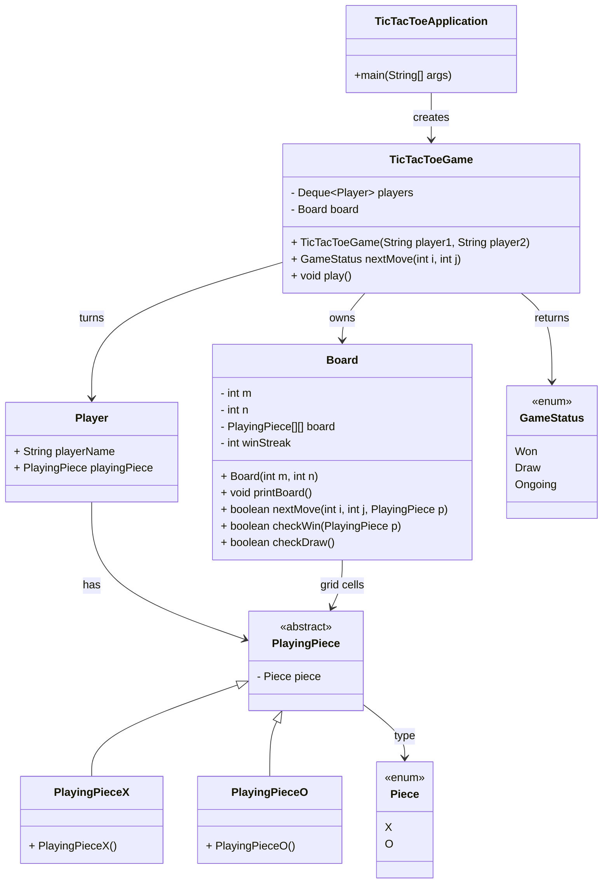

# Tic Tac Toe — org.example.tic.tac.toe

This directory contains a simple, console-based Tic Tac Toe implementation designed to illustrate clean separation of concerns and an extensible model. It can serve as a starting point for adding features such as variable board sizes, different win conditions, bots/AI, or UI frontends.

## 1) Overview and Intent
- Goal: Provide a minimal, readable implementation of Tic Tac Toe with clear roles for Board, Players, and Game orchestration.
- Style: Synchronous, console I/O for moves; no external libraries for gameplay logic.
- Key idea: The game is turn-based; each move either updates the board or is rejected. The Board reports wins/draws; the Game orchestrates turns and I/O.

## 2) Package Structure
- TicTacToeApplication: Entry point with main(). Creates and starts a game.
- TicTacToeGame: Orchestrates gameplay, manages the turn order (queue of players), delegates validations and checks to Board.
- Board: Holds the 2D grid of PlayingPiece, prints the board, validates moves, and checks for win/draw.
- Player: Immutable holder of a name and a PlayingPiece.
- PlayingPiece (abstract) and concrete pieces PlayingPieceX / PlayingPieceO. Backed by Piece enum { X, O }.
- GameStatus enum: Won, Draw, Ongoing.

## 3) How to Run
Option A: From an IDE
- Run class: org.example.tic.tac.toe.TicTacToeApplication

Option B: From command line (Maven)
- Build: mvn -q -DskipTests package
- Run:  java -cp target/classes org.example.tic.tac.toe.TicTacToeApplication

## 4) Gameplay and Input Format
- Board size: 3x3 by default (configured in Board constructor in TicTacToeGame).
- Players: Two players, automatically created as "player1" (X) and "player2" (O).
- Turn order: Maintained as a queue; after each valid move, the player is rotated to the back of the queue.
- Input prompt: Enter row,column
  - Example input: 0,2 to place a piece at row 0, column 2.
  - Indexing: 0-based indices for both row and column. Valid values are 0..2 for a 3x3 board.
- Invalid input or moves:
  - If the chosen cell is already occupied or the format is wrong, the game prints "Enter valid inputs" and prompts again without switching turns.

## 5) Sample Session
Example console interaction (user input in quotes):
- Initial empty board is printed.
- Prompt: Enter row,column
- User: "0,0"
- Board updates and prints.
- Next prompt for the other player.
- Continue until either:
  - A player wins: prints "<playerName> Wins!!"
  - A draw: prints "Game Drawed" (i.e., no empty cells and no winner).

Note: The actual formatting includes tabs between cells; empty cells print as blank.

## 6) Design and Responsibilities
- TicTacToeGame
  - Holds Deque<Player> players and Board board.
  - nextMove(i, j):
    - Delegates to board.nextMove(i, j, currentPiece).
    - Prints board, checks win/draw via the Board.
    - Rotates players and returns a GameStatus.
  - play(): Handles input loop and basic error messages.

- Board
  - Data: m (rows), n (cols), PlayingPiece[][] board, winStreak = min(m, n) (reserved for extensions).
  - printBoard(): Console rendering with separators.
  - nextMove(i, j, piece): Places piece if empty; returns true if successful.
  - checkWin(piece): Checks rows, columns, and both diagonals for a full line of the same reference (see notes below).
  - checkDraw(): Returns true if all cells are non-null.

- Player
  - Holds playerName and a PlayingPiece; both are final.

- Pieces
  - PlayingPiece is an abstract class with a Piece enum value (X or O).
  - PlayingPieceX and PlayingPieceO are concrete, passing Piece.X / Piece.O to the super constructor.

## 7) Algorithms and Notes
- Win Check:
  - Rows: For each row i, if all board[i][j] are the same as the given PlayingPiece reference, it’s a win.
  - Columns: For each column j, if all board[i][j] are the same reference, it’s a win.
  - Diagonals: Both primary (i,i) and secondary (i,n-1-i) must match the reference.
- Equality by Reference:
  - The implementation compares PlayingPiece references directly (board[i][j] != playingPiece). This works because each player has a distinct PlayingPiece instance and that instance is propagated when placing moves.
  - If you change to value-based comparisons (e.g., by Piece enum), adapt checkWin accordingly.
- Bounds Checking:
  - The current nextMove assumes indices are within bounds. The interactive loop may throw exceptions if out-of-range indices are entered; these are caught and prompt the user to "Enter valid inputs".

## 8) Complexity
- nextMove(): O(1) to place a piece + O(1) print per cell in board.printBoard() which is O(m*n) for rendering.
- checkWin(): O(m*n) in worst case (it scans rows, columns, and diagonals; effectively O(m*n) for the scans performed).
- checkDraw(): O(m*n)
- Memory: O(m*n) for the grid.

## 9) Limitations and Edge Cases
- Board bounds are not explicitly checked inside Board.nextMove(); invalid indices from user input are handled by exceptions caught in the Game loop.
- checkWin uses reference equality of PlayingPiece; if you refactor how pieces are stored, update comparisons.
- winStreak is set but not currently used for arbitrary streak lengths; wins are strictly full-line for 3x3.
- No persistence, no undo, no move history.

## 10) Extending the Game
- Variable board sizes: Change new Board(m, n) in TicTacToeGame and update prompts accordingly.
- Custom win conditions (winStreak):
  - Use Board.winStreak to check for k-in-a-row horizontally, vertically, and diagonally rather than full-line equality.
- Input validation:
  - Add explicit bounds checks in Board.nextMove and produce more descriptive messages.
- Bot/AI player:
  - Introduce a strategy interface (e.g., MoveSelector) and a ComputerPlayer that computes moves.
- UI frontends:
  - Replace console I/O with GUI or REST endpoints. Keep Board and Game logic headless and testable.

## 11) API Snapshot
Minimal shapes used in this module:

```java
// Entry point
public class TicTacToeApplication {
  public static void main(String[] args) {
    TicTacToeGame game = new TicTacToeGame("player1", "player2");
    game.play();
  }
}

// Game orchestration
public class TicTacToeGame {
  public TicTacToeGame(String player1, String player2) { /* ... */ }
  public GameStatus nextMove(int i, int j) { /* ... */ }
  public void play() { /* ... */ }
}

// Board operations
public class Board {
  public Board(int m, int n) { /* ... */ }
  public void printBoard() { /* ... */ }
  public boolean nextMove(int i, int j, PlayingPiece p) { /* ... */ }
  public boolean checkWin(PlayingPiece p) { /* ... */ }
  public boolean checkDraw() { /* ... */ }
}
```

## 12) Class Diagram (Mermaid)
The following diagram reflects the current relationships among classes:



## 13) FAQs
- Why 0-based indexing? It matches typical array indices and simplifies addressing.
- Why reference equality in checkWin? Simplicity, given the current design where each player has a unique PlayingPiece instance. You can switch to enum-based comparison for clarity.
- How to prevent invalid indices? Add bounds checks in Board.nextMove and validate input before parsing.
- Can I add more players or symbols? The current design assumes two players; to extend, generalize Piece and player queue handling.

## 14) Rendering the Diagram
- Many IDEs/renderers support Mermaid in Markdown. If not, copy the code block into an online Mermaid editor (e.g., https://mermaid.live) to visualize.
